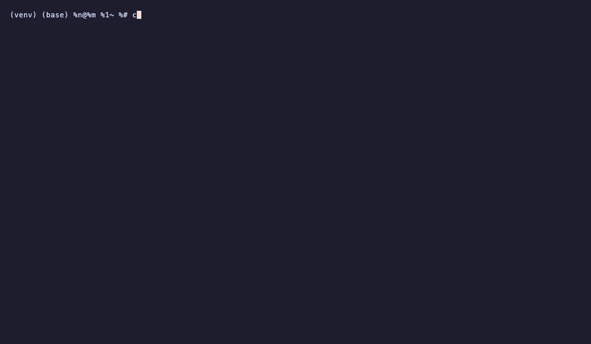

## Why I Built This

I'm Shashank Shandilya, a software engineer working on production-grade agentic database support systems.

I built NexusOps to demonstrate end-to-end AI engineering skills: from training
custom PyTorch models to orchestrating multi-agent workflows with LangGraph
and deploying on Kubernetes with full CI/CD.

The problem space (autonomous SRE) genuinely interests me because in my current organisation I see multiple teams working on migrating databases from on premises to cloud environments. This process is bringing up new challenges and concerns. I often see multiple teams escalating issues related to this to the DBA team and the production readiness team and there is always a need for more support. I believe that an agentic system like this can help solve these problems more efficiently and effectively. Additionally I am very interested in the intersect of AI and DevOps and wanted to explore this space further.

# 🚀 NexusOps - Autonomous AI Site Reliability Engineer

> An autonomous multi-agent system that monitors cloud infrastructure, detects anomalies, diagnoses root causes, proposes fixes, and executes remediation actions with human approval.

## Demo



[](https://python.org)
[](https://pytorch.org)
[](https://langchain-ai.github.io/langgraph/)
[](https://fastapi.tiangolo.com)
[](https://docker.com)
[](https://kubernetes.io)

---

## 🧠 Architecture

```
   ┌────────────────────────────────────────────────────────────────────────┐
   │                         NEXUSOPS SUPERVISOR                            │
   │                        (LangGraph StateGraph)                          │
   └────────────────────────────────────────────────────────────────────────┘
                                   │
                  --------------------------------------------------
                 |              SENTINAL                            |
                 |      Trained on 5,000 synthetic sequences        |
                 | AUROC: 0.9933, Precision: 1.00 at threshold 0.60 |
                 |                                                  |
                 ---------------------------------------------------
                       ┌───────────┘
                       ▼
              ┌─────────────┐   ┌──────────┐   ┌───────────┐
              │  DETECTIVE  |-->|  ORACLE  |-->|  SURGEON  |
              │ (Root Cause)│   │ (Predict)│   │(Remediate)│
              └─────────────┘   └──────────┘   └───────────┘
                                                     │
                                     ┌---------------┘
                                     │
                                     ▼
                            ┌──────────────────┐
                            │  HUMAN APPROVAL  │
                            │(interrupt_before)│
                            └──────────────────┘
                                    |
                        ┌───────────┼───────────┐
                        ▼           ▼           ▼
               ┌──────────┐   ┌──────────┐   ┌──────────────┐
               │ SURGEON' │   │  SURGEON'│   │   SCRIBE     │
               │ (execute)│   │ (failure)│   │ (Report)     │
               └──────────┘   └──────────┘   └──────────────┘
                                      │
                                      ▼
                                    [END]
```

## 📦 Tech Stack

| Layer       | Technologies                                                                                             |
| ----------- | -------------------------------------------------------------------------------------------------------- |
| **AI / ML** | PyTorch 2.x, TensorFlow/Keras 2.16, LangChain, LangGraph                                                 |
| **LLMs**    | OpenAI GPT-4o-mini, Groq Llama-3.3-70b                                                                   |
| **MLOps**   | MLflow, LangSmith, Prometheus                                                                            |
| **Backend** | FastAPI, Redis, PostgreSQL + pgvector, Qdrant, HuggingFace Sentence Transformers, SQLite (checkpointing) |
| **DevOps**  | Docker, Docker Compose                                                                                   |

## 🗂️ Project Structure

```
nexusops/
├── agents/                    # All 5 specialized agents
│   ├── sentinel/              # PyTorch anomaly detection agent
│   ├── detective/             # RAG-based root cause analysis agent
│   ├── oracle/                # Predictive failure agent
│   ├── surgeon/               # Remediation execution agent
│   └── scribe/                # Report generation agent
├── supervisor/                # LangGraph orchestration
├── ml/                        # PyTorch & TensorFlow models
│   ├── pytorch/               # LSTM autoencoder
│   └── tensorflow/            # Log pattern classifier
├── simulator/                 # Synthetic metrics & log generator
├── api/                       # FastAPI gateway
├── .github/workflows/         # CI/CD pipelines
├── docker/                    # Dockerfiles per service
└── tests/                     # Unit + integration tests
```

## 🚀 Quick Start (Phase 1 — Local)

```bash
# 1. Clone and enter
git clone <your-repo-url>
cd nexusops

# 2. Create virtual environment
python3 -m venv venv && source venv/bin/activate

# 3. Install dependencies
pip install -r requirements.txt

# 4. Copy and configure env
cp .env.example .env
# Edit .env with your API keys

# 5. Start local services (PostgreSQL, Redis)
docker-compose up -d

# 6. Run the metrics simulator
python -m simulator.generator

# 7. Train the PyTorch anomaly model
python -m ml.pytorch.train

# 8. Train the TensorFlow log classifier
python -m ml.tensorflow.train

# 9. Start the FastAPI gateway
uvicorn api.main:app --reload --port 8000

# 10. (Optional) Launch the full agent graph
python -m supervisor.run
```

## Example Output

A real incident run `payment-service` in `prod` with CPU at 97%, memory at 91%, latency at 5860ms, error rate at 20.5%.

**Sentinel detects the anomaly:**

> PyTorch LSTM anomaly score: **0.784** (threshold 0.60) -> incident `15460a2f` created, LangGraph pipeline triggered

**Detective (root cause analysis):**

> "The payment-service pod is likely experiencing a high error rate due to a software bug or misconfiguration, causing it to fail requests and trigger the HighErrorRate metric. This is also driving increased CPU and memory usage, as well as request latency."

**Blast radius:**

> "If left unaddressed, this could impact order processing, user accounts, and customer support — potentially leading to failed transactions and revenue loss."

**Surgeon proposes 3 remediation actions — pipeline pauses for human approval:**

> 1. `[MEDIUM RISK]` `kubectl rollout undo deployment payment-service -n prod` - rollback to last known good version
> 2. `[LOW RISK]` `kubectl scale deployment payment-service --replicas=2 -n prod` - scale out to absorb load
> 3. `[LOW RISK]` `kubectl delete pod -l app=payment-service -n prod` - force pod restart to clear transient state

**Human approves actions 1 & 2 via API:**

```bash
curl -X POST http://localhost:8000/api/v1/incidents/15460a2f/approve \
  -d '{"approved": true, "approver": "on-call-engineer", "approved_action_indices": [0, 1]}'
```

**Scribe generates post mortem (stored in Qdrant for future RAG lookups):**

```
# Incident Report: 15460a2f
## Summary
payment-service / prod - anomaly score 0.784 - triggered metrics:
cpu_usage_percent, memory_usage_percent, request_latency_ms, error_rate_percent

## Root Cause
Software bug or misconfiguration caused a high error rate, which in turn drove
elevated CPU/memory usage and request latency. Confidence: 80%.

## Impact
Order processing, user accounts, and customer support - potential revenue impact
if not resolved within ~30 minutes of trigger time.

## Remediation
1. kubectl rollout undo deployment payment-service -n prod  [EXECUTED]
2. kubectl scale deployment payment-service --replicas=2 -n prod  [EXECUTED]

## Prevention
- Add automated rollback policy for HighErrorRate > 15% sustained over 5 minutes
- Set HPA min-replicas to 2 for payment-service to prevent single-pod bottleneck
- Integrate canary deploys to catch regressions before full rollout
```

## 📊 Phases

- [x] **Phase 1** - Foundation: PyTorch + TensorFlow models, FastAPI, local simulator
- [x] **Phase 2** - Multi-Agent: Full LangGraph graph with all 5 agents

## Limitations and Future work

```
## Limitations
- Currently the LSTM is trained on synthetic self-generated metrics, so the AUROC score is not based on real infrastructure metrics that
can include more noise or different edge cases.
- Also right now, there is no way to tell if the LSTM autoencoder will out perform a static threshold or a z-score detector on this data.

## Future-Work
- Validate the LSTM autoencoder against real Prometheus metric exports from a local K3s cluster to benchmark performance other than synthetic distributions.
- Add a z-score threshold baseline detector and compare AUROC/precision-recall against the LSTM to quantify the value of learned temporal patterns.
- Extend the synthetic generator with realistic noise (gradual metric drift, diurnal traffic cycles, and partial failures) to better approximate production telemetry.

```

---

_Built as a capstone project to demonstrate production-grade AI engineering skills._
